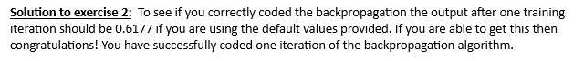

# NeuralNetworkFromScratch
Just a small, modular fully connected neural network made in Python without any major libraries other than NumPy. This was how I entered the world of ML. 

Learning exercise verification:

